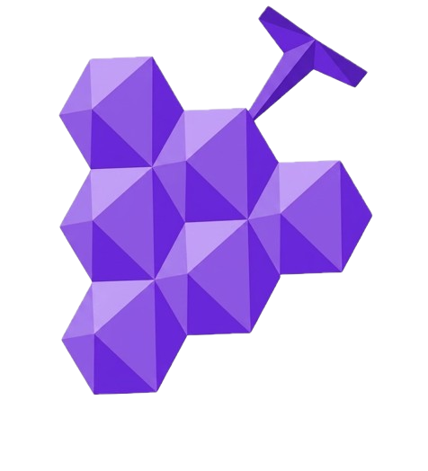

<p align="center">
  
</p>

# Podo

Self-hosted music streaming server. One container, no external dependencies.

## Deploy (using published image)

```bash
cd deploy
cp .env.example .env
# Edit .env — set JWT_SECRET

# Edit docker-compose.yml:
#   image: ghcr.io/byeolki/podo:latest
#   volumes: point to your actual music and data paths

docker compose up -d
```

On first run, create the admin account:

```bash
curl -X POST http://localhost:3000/api/v1/auth/bootstrap \
  -H 'Content-Type: application/json' \
  -d '{"name":"Admin","email":"admin@example.com","password":"changeme"}'
```

## Build from source

```bash
cp .env.example .env
docker compose up -d
```

Or run locally without Docker:

```bash
npm install
cp .env.example .env   # edit as needed
npm run start:dev
```

## Environment variables

| Variable | Default | Description |
|---|---|---|
| `JWT_SECRET` | `change-me-in-production` | **Required in production** |
| `JWT_ACCESS_EXPIRES_IN` | `15m` | Access token lifetime |
| `JWT_REFRESH_EXPIRES_IN` | `30d` | Refresh token lifetime |
| `PORT` | `3000` | HTTP port |
| `HOST` | `0.0.0.0` | Bind address |
| `DB_PATH` | `./data/podo.db` | SQLite database path |
| `LIBRARY_ROOTS` | *(empty)* | Comma-separated paths to scan on startup |
| `UPLOAD_DIR` | `./data/uploads` | Uploaded files storage |
| `ARTWORK_DIR` | `./data/artwork` | Artwork image storage |
| `TRANSCODE_CACHE_DIR` | `./data/transcode-cache` | Transcoding segment cache |
| `STATIC_DIR` | `./public` | Web client static files |
| `MUSICBRAINZ_USER_AGENT` | `podo/0.1.0` | User-Agent for MusicBrainz requests |
| `METRICS_ENABLED` | `false` | Expose `/metrics` Prometheus endpoint |
| `CORS_ORIGIN` | `*` | Allowed CORS origin(s) |
| `TRUST_PROXY` | `true` | Trust `X-Forwarded-*` headers (set `false` if not behind a reverse proxy) |
| `RATE_LIMIT_MAX` | `1000` | Global requests per minute per IP |
| `AUTH_RATE_LIMIT_MAX` | `10` | Login/register/refresh attempts per minute per IP |
| `SWAGGER_ENABLED` | *(dev only)* | Set `true` to expose `/api/docs` in production |
| `OPENAI_API_KEY` | *(empty)* | Enables AI metadata extraction on scan |
| `OPENAI_MODEL` | `gpt-4o-mini` | Model used for AI metadata extraction |
| `YTDLP_PATH` | `yt-dlp` | Path to the yt-dlp binary for URL downloads |

## API

Full OpenAPI spec at `/api/docs` (development; set `SWAGGER_ENABLED=true` to expose it in production).

Base path: `/api/v1`

Key endpoints:
- `POST /api/v1/auth/bootstrap` — create first admin (one-time)
- `POST /api/v1/auth/login` — get access + refresh tokens
- `POST /api/v1/auth/invite` — generate invite token (admin); registration requires one
- `GET  /api/v1/tracks` — browse library
- `GET  /api/v1/stream/{track_id}` — stream with HTTP Range support
- `GET  /api/v1/search?q=` — full-text search
- `GET  /api/v1/artists` / `GET /api/v1/artists/{name}` — artists derived from track metadata
- `POST /api/v1/upload` — upload audio/video files (any authenticated user)
- `GET/PATCH/DELETE /api/v1/upload/files[/{source_id}]` — list, rename, delete own uploads
- `GET/PATCH/DELETE /api/v1/admin/files[/{source_id}]` — admin file browser over all uploads
- `GET  /api/v1/admin/storage` — per-directory usage + disk capacity
- `POST /api/v1/playlists/{id}/tracks` — append tracks to a playlist
- `GET  /api/v1/radio/station?seed_artist_name=` — auto-generated station
- `GET  /api/v1/sync?since=` — delta sync cursor
- `GET  /health` — Docker healthcheck

## Real-time events

Connect via Socket.IO to `/api/v1/events` with `{ auth: { token: "<access_token>" } }`.

Events emitted: `track.upserted`, `track.removed`, `scan.started`, `scan.progress`, `scan.completed`.

## Architecture

- **NestJS + Fastify** — HTTP server
- **SQLite + Drizzle ORM** — WAL mode, FTS5 full-text search built in
- **ffmpeg/ffprobe** — media probing and on-the-fly transcoding
- **p-queue** — in-process job queue (no Redis required)
- **chokidar** — filesystem watch for instant library updates

### Track ↔ Source model

A *Track* is a logical song (what playlists, favorites, and history reference).
A *Source* is a physical file — local audio or video. One track can have multiple sources.
Streaming resolves the best available source by `media_kind` and `priority`.
Files in the same directory sharing a filename stem (e.g. `song.mp3` + `song.mp4`)
are attached to the same track, so a music video plays alongside its audio.

Metadata has a base layer (ID3 → MusicBrainz → Last.fm) with a user override layer on top.
User edits always win — automatic sources never overwrite manual input.

### Artist model

There is no artists table. Artists are derived at query time from track text fields
(`tracks.artist` plus the `artist` / `original_artist` override columns), split on commas.
Artist pages are addressed by URL-encoded name, and cover tracks distinguish the
performing artist from the original artist.

## Security

- Invite-only registration — accounts require an admin-issued invite token; `bootstrap` only works while the server has zero users
- JWT auth with short-lived access tokens and revocable refresh tokens (bcrypt-hashed at rest); production refuses to start with the default `JWT_SECRET`
- Security headers via helmet (CSP, X-Frame-Options, etc.)
- Global per-IP rate limiting plus a stricter limit on credential endpoints (`RATE_LIMIT_MAX`, `AUTH_RATE_LIMIT_MAX`)
- Upload hardening: extension allowlist, 500MB size cap, filename sanitization; non-admins can only rename/delete their own uploads
- Swagger UI disabled in production unless `SWAGGER_ENABLED=true`

## License

AGPL-3.0
