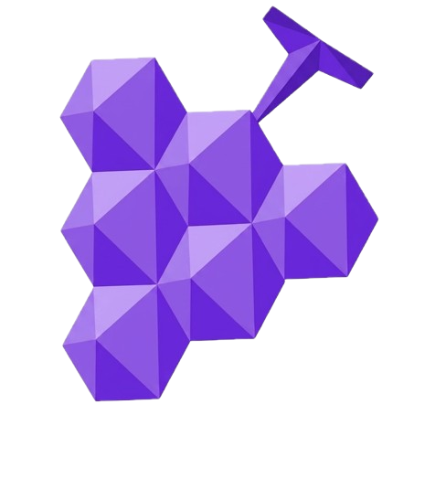
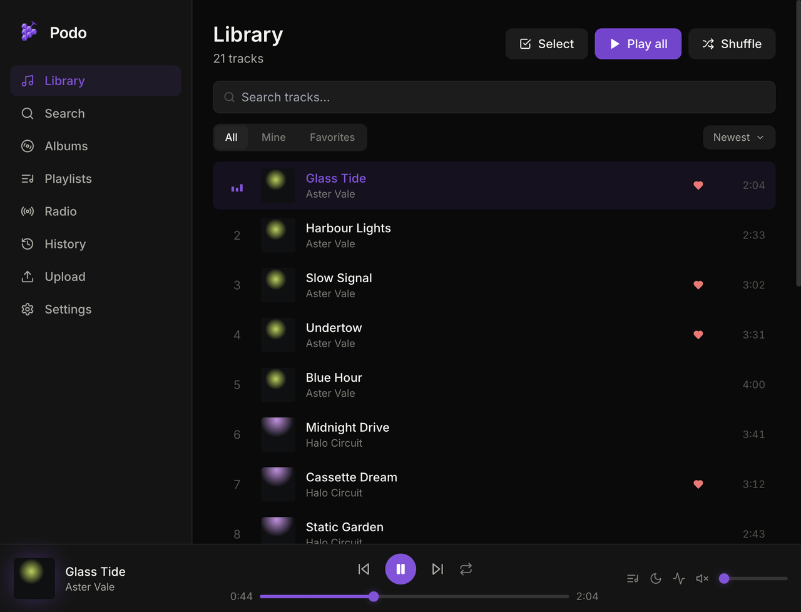
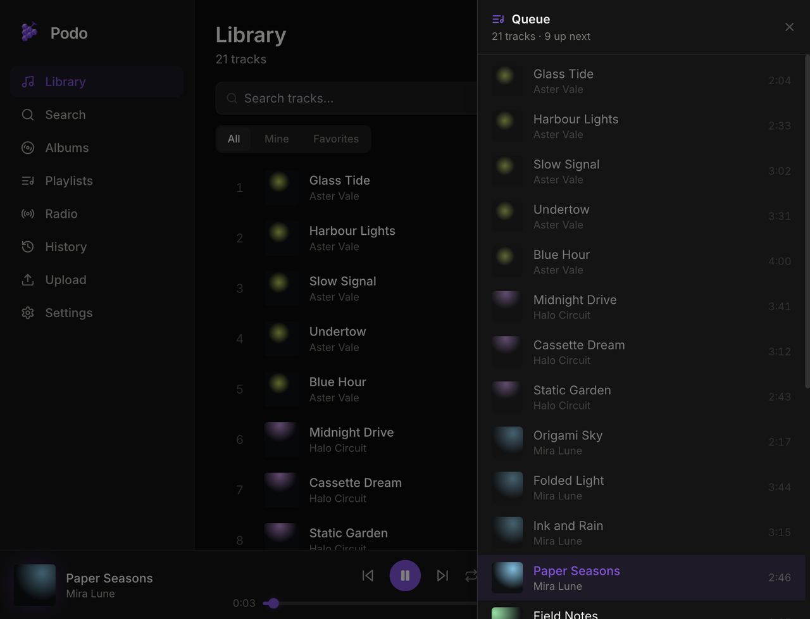
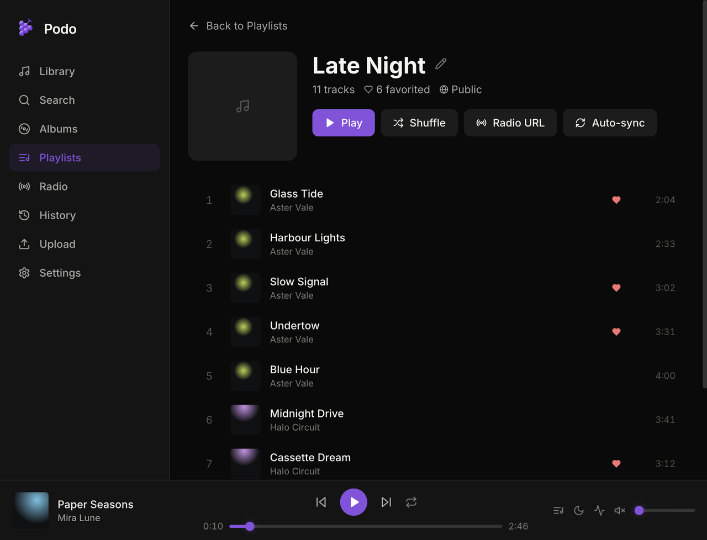
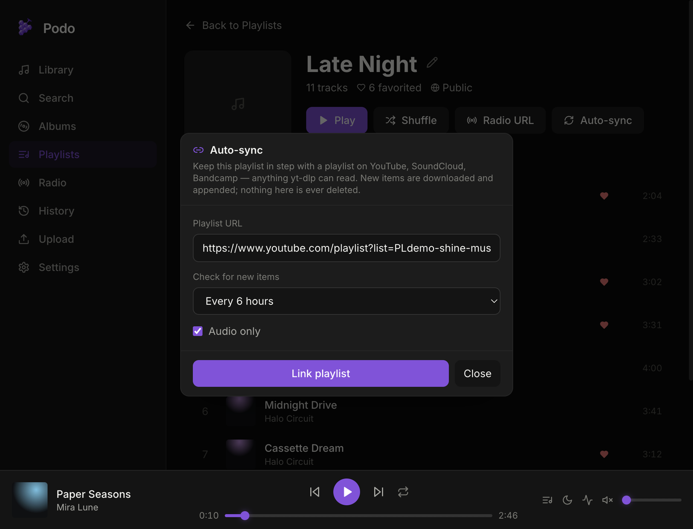
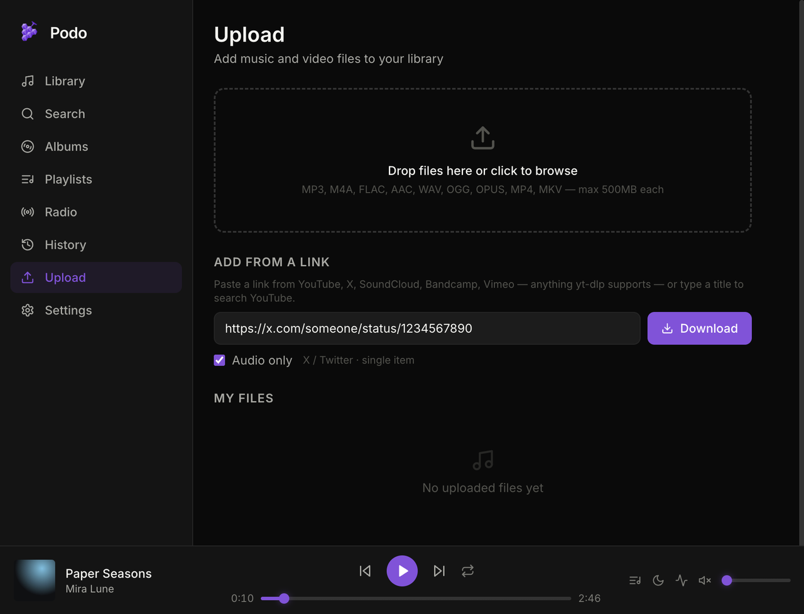
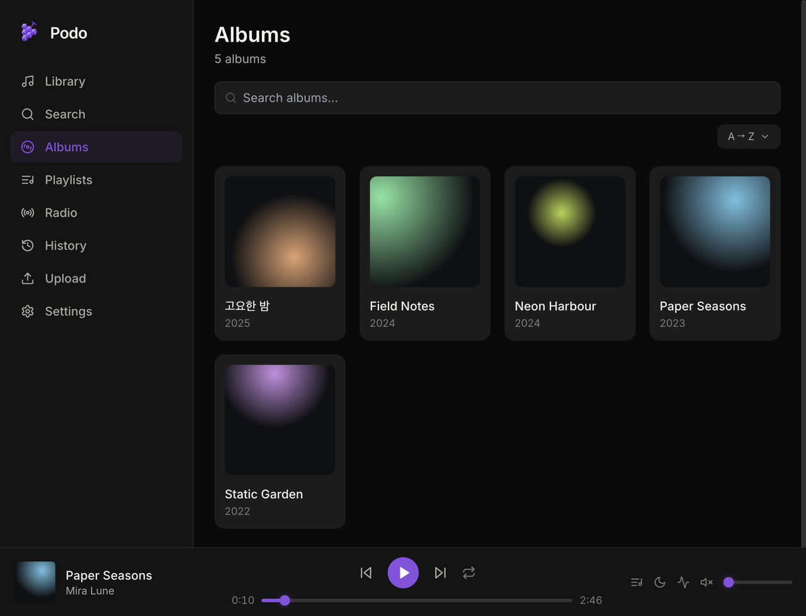
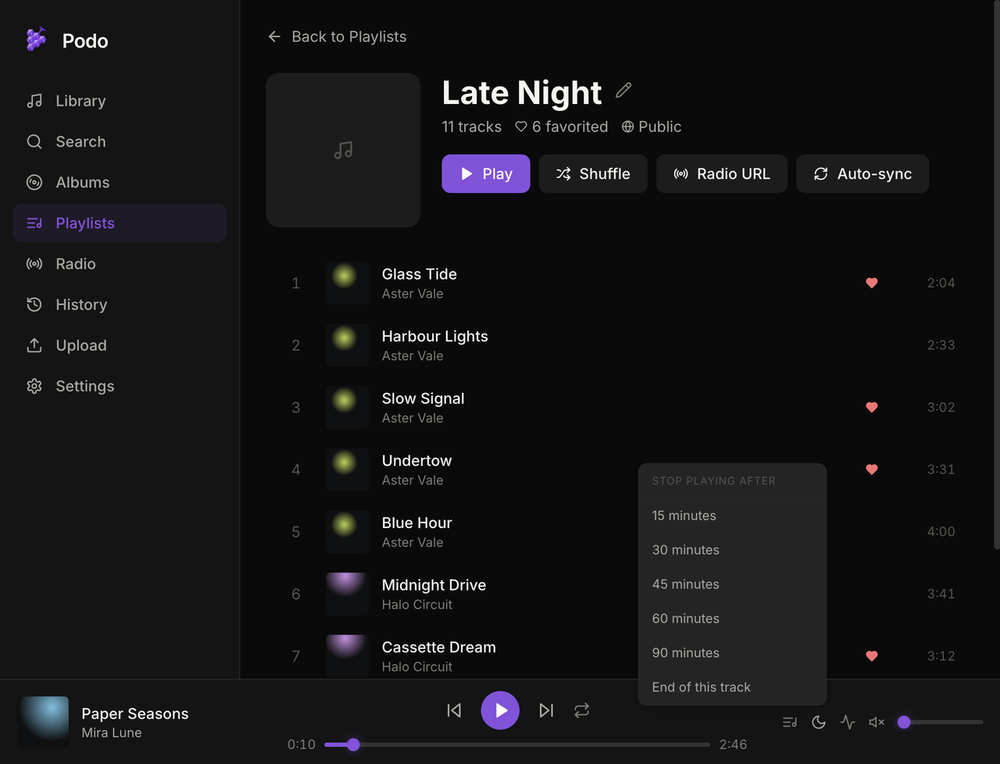

<p align="center">
  
</p>

<h1 align="center">Podo</h1>

<p align="center">
  <b>Your music library, on your own server.</b><br />
  One container. No Postgres, no Redis, no search cluster, no API keys.
</p>

<p align="center">
  <a href="https://github.com/byeolki/podo/actions/workflows/docker.yml"></a>
  <a href="https://github.com/byeolki/podo/pkgs/container/podo"></a>
  <a href="LICENSE"></a>
  
</p>

---

Podo scans the music you already have, and streams it to a browser or to the
[Muscat](https://github.com/byeolki/muscat) app on your iPhone and Mac. It also
knows how to go get the music you *don't* have yet: paste a URL, or search
YouTube from inside the app, and it lands in your library with artwork and
synced lyrics attached.

It's built for a small group sharing one server — a household, a few friends —
so accounts are invite-only and everyone gets their own favorites, playlists and
history over the same library.

```bash
docker run -d -p 3000:3000 \
  -e JWT_SECRET="$(openssl rand -hex 32)" \
  -e LIBRARY_ROOTS=/music \
  -v /path/to/music:/music:ro -v podo-data:/data \
  ghcr.io/byeolki/podo:latest
```

Then open `http://localhost:3000` and create the first admin account.

## What it looks like

<p align="center">
  
</p>

<table>
  <tr>
    <td width="50%"></td>
    <td width="50%"></td>
  </tr>
  <tr>
    <td align="center"><em>The queue — played, playing, up next</em></td>
    <td align="center"><em>A playlist: favorites-only playback, radio URLs, auto-sync</em></td>
  </tr>
  <tr>
    <td width="50%"></td>
    <td width="50%"></td>
  </tr>
  <tr>
    <td align="center"><em>Auto-sync a playlist from YouTube, SoundCloud, …</em></td>
    <td align="center"><em>Paste a link from anywhere yt-dlp supports</em></td>
  </tr>
  <tr>
    <td width="50%"></td>
    <td width="50%"></td>
  </tr>
  <tr>
    <td align="center"><em>Albums, with cover art pulled from your files' tags</em></td>
    <td align="center"><em>Sleep timer — a delay, or the end of this track</em></td>
  </tr>
</table>

## Why it might suit you

**One process, one file.** SQLite in WAL mode is the database, SQLite FTS5 is the
search engine, p-queue is the job runner, a directory is the cache. There is
nothing else to deploy, back up, or keep upgraded — `data/` is the whole state.

**Your edits are permanent.** Scanned tags and (optionally) an LLM fill in what
they can, but they write to a base layer. Anything you type by hand goes in an
override layer on top, and no rescan, re-download or re-tag ever overwrites it.

**A song, not a file.** A track can have several sources: the FLAC and the music
video are one entry, not two. Drop `song.mp3` and `song.mp4` in the same folder
and Podo pairs them; the video button appears next to the track and plays in
sync with the audio.

**Made for libraries that aren't in English.** Alternate titles are free text per
track, so "米津玄師" is findable as "Kenshi Yonezu" or "Yonezu Kenshi". Search
also expands artist names through MusicBrainz aliases before it queries.

**Music you don't own yet.** yt-dlp is wired in for both downloading and
searching, so there's no second tool and no API key — and because it's yt-dlp,
that means YouTube, X, SoundCloud, Bandcamp, Vimeo and the [thousand-odd other
sites](https://github.com/yt-dlp/yt-dlp/blob/master/supportedsites.md) it knows,
not just one. Downloads keep the source URL, pull the thumbnail, and turn
manually-uploaded subtitle tracks into synced, per-language lyrics —
auto-generated captions are deliberately skipped as too unreliable to call lyrics.

**Nothing is a dead end.** Because the source URL is kept, a track can be
re-fetched later: an upstream re-upload, a remaster, subtitles added after the
fact. The new file replaces the old one *on the same track*, so the playlists,
favorites and play counts pointing at it survive — the alternative, deleting and
re-downloading, throws all of that away.

**AI that is off until you ask for it.** Nothing is chosen implicitly: with
nothing configured there is no AI, and no model is ever contacted. Turn it on
with an OpenAI key, or with the Claude Code CLI bundled in the image — the second
so a self-hosted server can have these features without its operator
provisioning billing for them. Provider, model and each feature are changed from
Settings → AI at runtime, and the model is free text, so a newer one is a
settings change rather than an upgrade.

Two things it does. It fills track metadata from filenames on import, which is
what makes a folder of badly-named rips usable. And an assistant, a separate
switch again, docked at the edge of the dashboard: it searches your library,
queues tracks, builds playlists and corrects metadata in batches. It only ever
acts on ids its own tools returned, so it cannot offer you music you don't have,
and the tools it is given are the whole of what it can do — the model itself runs
with every file and network tool refused, in a temp directory, with nothing of
the server's environment.

**A command line for the big stuff.** `podo upload` streams files straight off
disk, walks directories, skips what the server already has (by name *and* size,
so two albums with an `01 Intro.mp3` both land), and retries — the things a
browser upload can't do with a folder of FLACs.

```bash
npm i -g .            # or run it from a checkout: node cli/podo.mjs
podo login https://music.example.com
podo upload ~/Music/Albums --jobs 2

# Files whose own names say nothing useful can be tagged as they go in
podo upload rip.flac --title "으르렁" --artist "세라, 윤단" --cover-of EXO --cover
podo upload ~/Music/Rips --metadata tags.csv
```

**Playlists that fill themselves.** Point a playlist at one on YouTube (or
anywhere else yt-dlp reads) and Podo checks it on a schedule, downloads what's
new and appends it. One-way and additive on purpose: when a video disappears
upstream, your copy stays — usually the whole reason to keep one.

**A radio station out of any playlist.** Mint a permanent URL and paste it into
VLC, a network speaker, a Discord bot — anything that can open a stream. It loops
forever in the codec you pick, with no login and no playback session behind it.

## How it compares

Podo is not trying to replace the big self-hosted media servers, and if one of
them already fits you, keep it.

- **Navidrome / Airsonic** are Subsonic servers: a huge client ecosystem, and a
  hard assumption that your files are already tagged the way you want. Podo has
  one web client and one native client instead, but it treats messy libraries as
  the normal case — an override layer for anything you fix by hand, alternate
  titles for non-English names, and yt-dlp wired in for the music that isn't on
  your disk yet.
- **Jellyfin / Plex** do everything, music included. Podo does only music, in one
  container with no companion services.
- **Plexamp** is the nicest music client of the lot, and it needs Plex.

The specific things Podo has that those don't: one track holding both an audio
file and its music video, playlists that keep themselves topped up from a
YouTube playlist, re-fetching a downloaded track in place, per-playlist public
radio URLs, and subtitle tracks imported as real synced lyrics.

## Features

| | |
|---|---|
| **Library** | Recursive scan with live filesystem watching, ffprobe metadata, album/version grouping, genres, soft deletes |
| **Playback** | HTTP Range streaming, on-the-fly ffmpeg transcode with a disk cache, ReplayGain/loudnorm normalization, per-track manual gain |
| **Video** | Music videos as a source of the same track, with thumbnail extraction |
| **Lyrics** | Synced (LRC-style) lyrics per language, imported from yt-dlp subtitle tracks |
| **Metadata** | ID3 tags → optional LLM fill → user override layer that always wins; multi-select AI autofill from the dashboard |
| **Search** | SQLite FTS5 over titles and albums, plus artist/alternate-title matching and MusicBrainz alias expansion |
| **Import** | Drag-and-drop upload, `podo upload` from the terminal, or yt-dlp from any supported site by URL, or YouTube search, with progress over websockets |
| **AI** | Off by default. Metadata filled from filenames, and an assistant that can search, queue, build playlists and fix metadata in batches — via an OpenAI key or the Claude Code CLI |
| **Re-fetch** | Pull a downloaded track again from its original URL — media, artwork and subtitles — in place, keeping the track and everything attached to it |
| **Auto-sync** | Subscribe a playlist to a remote playlist URL; new items are downloaded and appended on a schedule you pick |
| **Sharing** | Invite-only accounts, public playlists, permanent public radio URLs per playlist |
| **Per user** | Favorites, playlists, play history, listening stats |
| **Player** | Play queue, repeat modes, sleep timer, keyboard shortcuts (space, ←/→, n/p/m/q) |
| **Listening** | Sleep timer (preset delay or end-of-track) and favorites-only playback within a playlist, on both clients |
| **Clients** | Bundled React web dashboard + [Muscat](https://github.com/byeolki/muscat) for iOS/macOS |
| **Admin** | Library roots and scans, uploaded-file browser, storage and traffic stats, user management, radio token control, update notices |
| **Live** | Socket.IO events for scan and download progress, and a `/sync` cursor for delta sync |

## Install

### Docker (recommended)

```bash
cd deploy
cp .env.example .env      # set JWT_SECRET
# edit docker-compose.yml: point the volumes at your music and data paths
docker compose up -d
```

Create the first admin account — this only works while the server has zero users:

```bash
curl -X POST http://localhost:3000/api/v1/auth/bootstrap \
  -H 'Content-Type: application/json' \
  -d '{"name":"Admin","email":"admin@example.com","password":"changeme"}'
```

Everyone after that registers with an invite token an admin generates.

### From source

```bash
npm install
cp .env.example .env
npm run build:all         # web client + server
npm run start:prod
```

Requires Node 22, plus `ffmpeg`/`ffprobe` on PATH (and `yt-dlp` if you want URL
downloads). The Docker image bundles all three.

## Configuration

Everything is environment variables; the full list is in
[`.env.example`](.env.example). The ones that matter:

| Variable | Default | Description |
| --- | --- | --- |
| `JWT_SECRET` | `change-me-in-production` | **Required in production** — the server refuses to start with the default |
| `LIBRARY_ROOTS` | _(empty)_ | Comma-separated paths to scan on startup |
| `DB_PATH` | `./data/podo.db` | SQLite database |
| `UPLOAD_DIR` / `ARTWORK_DIR` / `TRANSCODE_CACHE_DIR` | `./data/*` | Where uploads, artwork and cached transcodes live |
| `JWT_ACCESS_EXPIRES_IN` / `JWT_REFRESH_EXPIRES_IN` | `15m` / `30d` | Token lifetimes |
| `CORS_ORIGIN` | `*` | Allowed origin(s) |
| `TRUST_PROXY` | `true` | Set `false` when not behind a reverse proxy |
| `RATE_LIMIT_MAX` / `AUTH_RATE_LIMIT_MAX` | `1000` / `10` | Requests per minute per IP, globally and on credential endpoints |
| `AI_ENABLED` | `false` | Master switch. Naming a provider or supplying a key also turns it on; with none of them set there is no AI at all |
| `AI_PROVIDER` | _(auto)_ | `openai` or `claude-code`. Defaults to `openai` when a key is present |
| `AI_CHAT_ENABLED` | `false` | The assistant, which can create playlists and edit metadata — its own switch |
| `OPENAI_API_KEY` / `OPENAI_MODEL` | _(empty)_ / `gpt-5.4` | For the `openai` provider |
| `ANTHROPIC_API_KEY` / `CLAUDE_CODE_PATH` | _(empty)_ / `claude` | For the `claude-code` provider. Needs a key, or an authenticated config mounted at `/root/.claude` |
| `YTDLP_PATH` | `yt-dlp` | Binary used for downloads and YouTube search |
| `MUSICBRAINZ_USER_AGENT` | `podo/0.1.0` | Identify your deployment; a generic UA gets rate-limited |
| `SWAGGER_ENABLED` | _(dev only)_ | Set `true` to expose `/api/docs` in production |
| `UPDATE_CHECK_ENABLED` | `true` | Check GitHub for a newer release. One outbound GET every 12h, nothing sent about your instance; set `false` to disable |

## API

Full OpenAPI spec at `/api/docs` in development. Base path is `/api/v1`.

- `POST /auth/bootstrap` — create the first admin (one-time)
- `POST /auth/login` · `POST /auth/refresh` · `POST /auth/invite`
- `GET /tracks` · `GET /tracks/{id}` · `PATCH /tracks/{id}/metadata`
- `GET /stream/{track_id}` — HTTP Range, optional transcode/normalize
- `GET /tracks/{id}/lyrics` — synced lyrics, per language
- `GET /search?q=` · `GET /albums` · `GET /history` · `GET /stats/me`
- `POST /upload` · `POST /download` (any yt-dlp site) · `GET /download/inspect?url=`
- `GET /download/search?q=` — local library first, then YouTube
- `GET /download/source/{track_id}` · `POST /download/refresh/{track_id}` — where a
  track came from, and re-fetching it from there
- `POST /playlists/from-url` — download a remote playlist and keep it as one
- `GET /ai/status` · `POST /ai/chat` — the assistant
- `GET /admin/ai` · `PUT /admin/ai` — provider, model and feature switches
- `GET/POST/PATCH/DELETE /playlists` · `POST /playlists/{id}/tracks`
- `GET/PUT/DELETE /playlists/{id}/subscription` · `POST /playlists/{id}/subscription/sync` — playlist auto-sync
- `POST /playlists/{id}/radio-tokens` → `GET /broadcast/{token}` (public stream)
- `GET /radio?seed_artist_name=` · `POST /radio/mix`
- `GET /sync?since=` — delta sync cursor
- `GET /health` — unauthenticated liveness probe

Real-time events over Socket.IO at `/api/v1/events` with
`{ auth: { token: "<access_token>" } }`: `track.upserted`, `source.removed`,
`scan.*`, `download.*`, `playlist.sync.*`.

## Updating

Podo tells you when a newer release is out — the Settings → Health tab shows a
notice with the release notes and the command to take it:

```bash
docker compose pull && docker compose up -d
```

Migrations run automatically at startup. The check is one unauthenticated
request to the GitHub releases API every 12 hours; no version, instance id or
anything else about your server is sent, and `UPDATE_CHECK_ENABLED=false` turns
it off completely.

## Security

- Invite-only registration; `bootstrap` works only while the server has no users
- Short-lived JWT access tokens, revocable refresh tokens, bcrypt-hashed at rest
- Every route authenticated by default — public endpoints are opt-in, one by one
- Per-IP rate limiting, stricter on credential endpoints
- helmet security headers with a locked-down CSP
- Upload hardening: extension allowlist, size cap, filename sanitization;
  non-admins can only touch their own uploads
- Streaming and artwork accept a `?token=` query parameter, because `<audio>`,
  `` and `AVPlayer` can't send headers — access tokens only, never refresh
  tokens

## Development

```bash
npm run typecheck         # tsc --noEmit
npm run build             # server
cd web && npm run dev     # SPA dev server, proxies /api to :3000
```

[`docs/ARCHITECTURE.md`](docs/ARCHITECTURE.md) is the internal reference: module
map, the guard model, the metadata-override invariant, how scanning and the
transcode cache actually work. Read it before changing anything structural.

Issues and pull requests are welcome.

## Clients

- **Web** — bundled, served by the same process at `/`
- **[Muscat](https://github.com/byeolki/muscat)** — native iOS and macOS client:
  background audio, lock-screen and Control Center controls, Live Activity and
  Dynamic Island

## License

[AGPL-3.0](LICENSE). If you run a modified version as a network service, its
source has to be available to its users.
